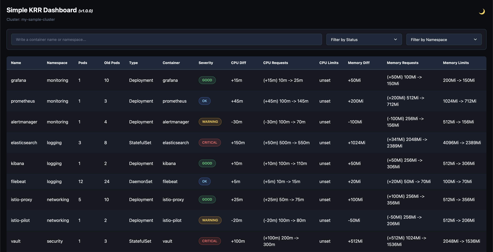

# simple-krr-dashboard

> [!NOTE]
> This project is not affiliated with [robusta-dev/krr](https://github.com/robusta-dev/krr).

Simple KRR dashboard for Kubernetes resource reporting, using [robusta-dev/krr](https://github.com/robusta-dev/krr) to gather data.



## Requirements

- Python 3.13+
- [pipenv](https://pipenv.pypa.io/en/latest/) for dependency management
- [robusta-dev/krr](https://github.com/robusta-dev/krr) for Kubernetes resource reporting data

## Installation

### Data Collection

The dashboard uses data generated by `krr` using the following command:

```bash
krr simple --fileoutput report.table.csv --use-oomkill-data --formatter csv
```

### Local Installation

1. Clone the repository
2. Create and activate a virtual environment:

   ```bash
   python -m venv .venv
   source .venv/bin/activate  # On Unix/macOS
   # or
   .venv\Scripts\activate  # On Windows
   ```

3. Install dependencies:

   ```bash
   pipenv install
   ```

### Docker Installation

1. Build the Docker image:

   ```bash
   docker build -t simple-krr-dashboard .
   ```

2. Run the container:

   ```bash
   docker run -v $(pwd)/reports:/reports -p 8080:8080 simple-krr-dashboard
   ```

The dashboard will be available at http://localhost:8080

## Usage

### Local Usage

To run the dashboard:

```bash
pipenv run start
```

Or directly using Python (make sure you're in the project root directory):

```bash
PYTHONPATH=src python src/simple_krr_dashboard/main.py
```

### Docker Usage

The Docker container exposes port `8080` for the web interface (Gunicorn). You can access the dashboard by opening your web browser and navigating to http://localhost:8080

## Development Commands

```bash
# Run tests
pipenv run test

# Run linter
pipenv run lint

# Format code
pipenv run format

# Type checking
pipenv run typecheck
```

## Environment Variables

The following environment variables can be used to configure the application:

| Variable                        | Description                                           | Default                                                | Required |
| :------------------------------ | :---------------------------------------------------- | :----------------------------------------------------- | :------- |
| `APP_NAME`                      | Name of the application                               | "Simple KRR Dashboard"                                 | No       |
| `APP_ROOT`                      | URL prefix for the application (context root)         | "/"                                                    | No       |
| `APP_VERSION`                   | Version of the application                            | "1.0.0"                                                | No       |
| `KUBERNETES_CLUSTER_NAME`       | Name of the Kubernetes cluster                        | None                                                   | No       |
| `KUBERNETES_DASHBOARD_CSV_PATH` | Path to the CSV file containing Kubernetes data       | "/reports/report.table.csv"                            | No       |
| `LOG_LEVEL`                     | Logging level (DEBUG, INFO, WARNING, ERROR, CRITICAL) | "INFO"                                                 | No       |
| `LOG_FORMAT`                    | Format string for log messages                        | "%(asctime)s - %(name)s - %(levelname)s - %(message)s" | No       |
| `LOG_OUTPUT_FORMAT`             | Log output format (text, logfmt)                      | "text"                                                 | No       |
| `DISABLE_HTTP_LOGS`             | Disable HTTP access logs from Gunicorn                | "false"                                                | No       |

### Logging Configuration

The application uses two types of logs:

1. **Application Logs**: Controlled by `LOG_LEVEL` (DEBUG, INFO, WARNING, ERROR, CRITICAL) and `LOG_OUTPUT_FORMAT` (text, logfmt)
2. **HTTP Access Logs**: Controlled by `DISABLE_HTTP_LOGS` (true/false)

#### Log Output Formats

The application supports two log output formats:

##### Text Format (Default)

Human-readable text format suitable for development and debugging.

```bash
docker run -v $(pwd)/reports:/reports -p 8080:8080 -e LOG_OUTPUT_FORMAT=text simple-krr-dashboard
```

**Example output:**

```text
2025-12-12 20:30:45,123 - simple_krr_dashboard.main - INFO - Starting application
2025-12-12 20:30:45,456 - simple_krr_dashboard.data - WARNING - No cluster name configured
```

##### Logfmt Format

Machine-readable key-value format, ideal for log aggregation systems like Grafana Loki.

```bash
docker run -v $(pwd)/reports:/reports -p 8080:8080 -e LOG_OUTPUT_FORMAT=logfmt simple-krr-dashboard
```

**Example output:**

```text
time=2025-12-12T20:30:45.123456 level=info logger=simple_krr_dashboard.main msg="Starting application"
time=2025-12-12T20:30:45.456789 level=warning logger=simple_krr_dashboard.data msg="No cluster name configured"
```

#### Configuration Examples

**Disable HTTP access logs** (recommended for production):

```bash
docker run -v $(pwd)/reports:/reports -p 8080:8080 -e DISABLE_HTTP_LOGS=true simple-krr-dashboard
```

**Enable HTTP access logs** (useful for debugging):

```bash
docker run -v $(pwd)/reports:/reports -p 8080:8080 -e DISABLE_HTTP_LOGS=false simple-krr-dashboard
```

**Change application log level**:

```bash
# Show only errors
docker run -v $(pwd)/reports:/reports -p 8080:8080 -e LOG_LEVEL=ERROR simple-krr-dashboard

# Show debug information
docker run -v $(pwd)/reports:/reports -p 8080:8080 -e LOG_LEVEL=DEBUG simple-krr-dashboard
```

**Serve the dashboard under a custom path prefix**:

```bash
# Dashboard available at http://localhost:8080/dashboard/
docker run -v $(pwd)/reports:/reports -p 8080:8080 -e APP_ROOT=/dashboard simple-krr-dashboard
```

**Production-ready configuration with JSON logs**:

```bash
docker run -v $(pwd)/reports:/reports -p 8080:8080 \
  -e LOG_LEVEL=INFO \
  -e LOG_OUTPUT_FORMAT=json \
  -e DISABLE_HTTP_LOGS=true \
  simple-krr-dashboard
```

**Development configuration with detailed text logs**:

```bash
docker run -v $(pwd)/reports:/reports -p 8080:8080 \
  -e LOG_LEVEL=DEBUG \
  -e LOG_OUTPUT_FORMAT=text \
  -e DISABLE_HTTP_LOGS=false \
  simple-krr-dashboard
```

## Testing

The project uses pytest for testing. To run the tests:

1. Install test dependencies:

   ```bash
   pipenv install --dev
   ```

2. Run the tests:

   ```bash
   pipenv run pytest
   ```

3. Run tests with coverage report:

   ```bash
   pipenv run pytest --cov=simple_krr_dashboard tests/
   ```

### Test Structure

The tests are organized in the following structure:

```console
tests/
├── __init__.py
├── conftest.py           # Common test fixtures
├── test_app.py          # Application tests
├── test_config.py       # Configuration tests
├── test_dashboard.py    # Dashboard component tests
├── test_data.py         # Data processing tests
├── test_logging.py      # Logging tests
└── test_utils.py        # Utility function tests
```

### Writing Tests

When adding new features, please include corresponding tests. The project follows these testing guidelines:

- Use pytest fixtures for common setup
- Mock external dependencies (e.g., file system, data processing)
- Test both success and error cases
- Include docstrings for test functions
- Use meaningful test names that describe the behavior being tested

## Contributing

Please read the [CONTRIBUTING.md](CONTRIBUTING.md) file for details on our code of conduct and the process for submitting pull requests.
